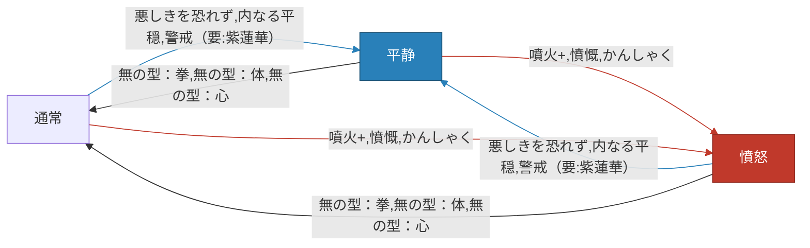

## ループ総論
2コスト（紫蓮華なら3コスト）以内で

- 平静への移行
- エナジー回収（＝平静の解除）
- 手札ドロー
  
を行う必要がある。

- 1コストで平静を解除する手段としては噴火+、かんしゃく、憤慨、一触即発、無の型シリーズ3種類の計7種類ある。
- 一方で**1コストで平静に移行する手段は悪しきを恐れず、内なる平穏、瞑想しか存在せず**、確定で移行できるのは内なる平穏、瞑想だけ、ループとして使えるのは実質悪しきを恐れず、内なる平穏だけと**非対称になっている**
- 手札ドローが可能なのは猪突猛進をかけた憤怒移行カード3種、無の型:心のみ

レアリティやカード種類が非対称構造になっているが、ここをどうにかするのがキモ。

また紫蓮華や制定（＋瞑想）は本来ループに組み込めないカードの組み込みを可能にするものと理解するのがいい。警戒などはその典型。

基本的に憤怒移行カード3種⇔平静移行カード2種によるループおよび悪しきを恐れず⇔無の型:心が一番成立しやすいので初心者はここから覚えるのがいい。
前段階にあたる有限ループや紫蓮華ありの場合の拡張方法、あるいはレリックや不動心を絡めたシナジーへの理解を深めて、ケースに応じた引き出しを広げると上達する。

## スタンス切り替え
### 通常
初期および無の型シリーズで移行することのできる状態。役割が2つある。

- 平静スタンスから移行することでエナジーを2得る
- 憤怒スタンスから移行することで2倍ダメージのデメリットを回避する

ただしどちらにしても平静⇔憤怒の直接移行に比べると、

- 平静スタンスに移行するのにカードとコストが必要
- 普通にしかダメージが与えられない

というデメリットがあるので次善の策と認識するのがよい。ただ「無の型：心」だけはカードドロー効果のため直接ループに組み込み可能のため要チェック。

|種類|名前|レアリティ|コスト（通常/UG）|
|--|--|--|--|
|アタック|無の型：拳|コモン|**1**|
|スキル|無の型：体|コモン|**1**|
|スキル|無の型：心|アンコモン|**1**|

### 平静
|種類|名前|レアリティ|コスト（通常/UG）|
|--|--|--|--|
|アタック|悪しきを恐れず|アンコモン|**1**|
|スキル|警戒|スターター|2|
|スキル|安らぎ|コモン|1/0|
|スキル|内なる平穏|アンコモン|**1**|
|スキル|瞑想|アンコモン|**1**|
|ポーション|スタンスポーション|アンコモン|0|
|レリック|涙滴状のペンダント|アンコモン|0|

警戒がUGしてもコスト2のため、ループ観点では内なる平穏、悪しきを恐れずの独壇場になっている。特に内なる平穏は確定で平静移行できる上、条件付きながら強烈なカードドローまでついてくるのがやりすぎ。ダブらせたい。
また瞑想はループには使えず、憤怒状態からの締めの逃げ先＆次ターンへの攻勢への準備という意味合いが強いが、制定があればより輝く。警戒のコストを落としてループに組み込めるようにしたい。

### 憤怒
|種類|名前|レアリティ|コスト（通常/UG）|
|--|--|--|--|
|アタック|噴火|スターター|2/**1**|
|アタック|かんしゃく|アンコモン|**1**|
|スキル|昂揚|コモン|**1/0**|
|スキル|一触即発|アンコモン|**1**|
|スキル|憤慨|アンコモン|**1**|
|ポーション|スタンスポーション|アンコモン|0|

とにもかくにも **噴火をUGするとコストが1になる** こと、そして **かんしゃく、憤慨共にコスト1で移行できる優等生** なので拾っておきたい。かんしゃくの場合、山札に戻る効果があるため、枚数は抑え目でもいい。

瞑想と対になる一触即発についてはコスト1ながら使いづらいイメージが先行して使ってないが、**「ターン開始/終了時は平穏」** というウォッチャーの鉄則に則ると、

- **(MUST) 次ターンに確実に平穏に移行するカードを引く必要がある**
- (SHOULD) 現在のターンの終了時に平穏である

という状況を作る必要があり、強力なカードドローが追加されるとはいえ心理的に敷居が高い。

### 神聖
|種類|名前|レアリティ|コスト（通常/UG）|マントラ増加量（通常/UG）|
|--|--|--|--|--|
|スキル|頂礼|コモン|0|2/3|
|スキル|崇拝|アンコモン|2|5|
|スキル|祈り|アンコモン|1|4|
|スキル|冒涜|レア|1|(強制神聖化)|
|スキル|信心|レア|1|ターンごとに2/3|
|ポーション|アンブロシア|レア|0|(強制神聖化)|
|レリック|ダマル|ノーマル|0|1|

マントラ軸自体あまり狙わないのと、スタンス切り替えまくるループ軸と相性悪いので語れることがない……

## 無限ループフローチャート

## ループとシナジーのあるレリック一覧

|レアリティ|名前|効果|コメント|
|--|--|--|--|
|コモン|ヌンチャク|アタックを10枚プレイするたび、◆を得る。|有限ループの段階だとしばしば重宝する|
|コモン|ペン先|アタックの使用10回ごとにダメージが2倍になる。|有限ループで重宝する他、無限ループの時間短縮にも|
|アンコモン|クナイ|1ターンに3枚の「アタック」をプレイするたび、敏捷性1を得る。|有限ループの段階だとしばしば重宝する|
|アンコモン|レターオープナー|1ターンの間に「スキル」を3枚プレイするたび、敵全体に5ダメージを与える。|内なる平穏や無の型:心を絡めたループで役に立つ。特に内なる平穏⇔無の型:心の通常無意味なループが意味を持つようになるのに注目したい|
|アンコモン|扇子|「アタック」を3枚プレイするたび、4のブロックを得る。|有限ループや不動心なしの心臓戦で重宝する|
|アンコモン|手裏剣|1ターンに3枚の「アタック」をプレイするたび、筋力1を得る。|有限ループで重宝する他、無限ループの時間短縮にも|
|アンコモン|日時計|デッキを3回シャッフルするたび、◆◆を得る。|有限ループで重宝しそうだが、これが発動する段階だと無限ループが成立していることが多い印象|
|アンコモン|涙滴状のペンダント|戦闘開始時、平静のスタンスに入る。|ループに限った話でもないが神|
|アンコモン|陰陽|「アタック」をプレイするたび、一時的に敏捷性1を得る。|有限ループの段階だとまぁまぁ重宝する印象|
|レア|ギャンブルチップ|戦闘開始時、好きなカードを捨てて同じ枚数のカードを引く。|これがあるのとないのでは安定度が全然違う|
|ボス|紫蓮華|	平静を解除したとき、追加で◆を得る|神|
|ボス|聖水|清水と置き換える。戦闘開始時、奇跡を3枚手札に加える。|無限ループに入るまでのセットアップが短縮されるので有用。無限ループが成立できる状況だとエナジーレリックより重要度高い。|
|ショップ|そろばん|デッキをシャッフルするたび、6ブロックを得る。|無限ループにさえ入ってしまえばブロックはそういらない（心臓戦除く）し、圧縮が進んでないと発動しないので微妙に役に立ちそうな、立たないような……|
|ショップ|医療キット|使用不可の「状態異常」がプレイできるようになる。「状態異常」はプレイすると廃棄する。|状態異常はループの天敵なので刺さる時はぶっ刺さる|